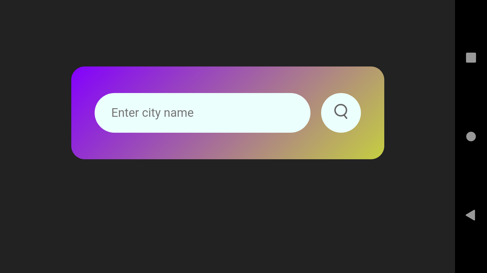
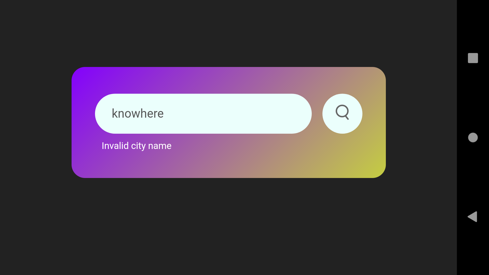

    

# Overview
YourCloud: A straightforward Android weather app that fetches real-time weather data for any city. Clean design, easy-to-use interface.

# Download APK
<a href="https://drive.google.com/file/d/1C7Ym_QAN-4akSba0yabcNXI8OqZ9GK2B/view?usp=sharing"> <i>Click here to download</i></a>

# Screenshots
### Simple and Straight-forward UI; Just provide a valid city name and the rest is on the app 

    
    
    
    

